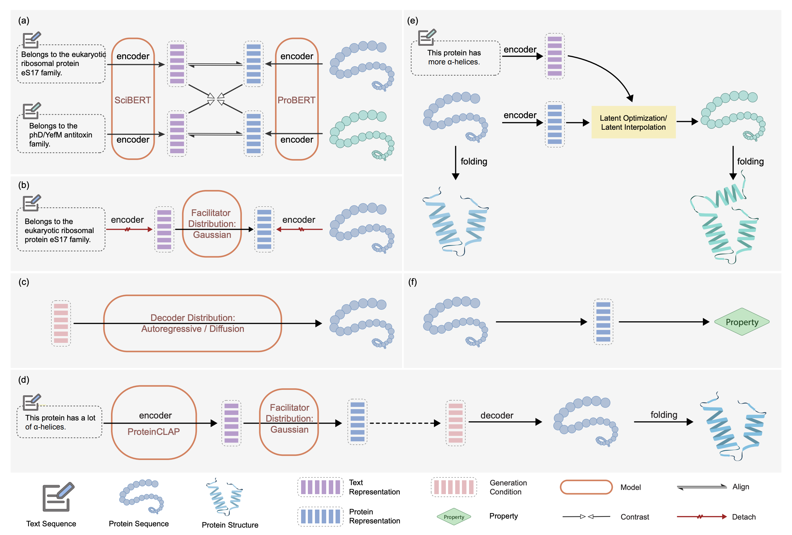

# ProteinDT: A Text-guided Protein Design Framework

Authors: Shengchao Liu, Yanjing Li, Zhuoxinran Li, Anthony Gitter, Yutao Zhu, Jiarui Lu, Zhao Xu, Weili Nie, Arvind Ramanathan, Chaowei Xiao<sup>\*</sup>, Jian Tang<sup>\*</sup>, Hongyu Guo<sup>\*</sup>, Anima Anandkumar<sup>\*</sup>

<sup>\*</sup> jointly supervised

[[Project Page](https://chao1224.github.io/ProteinDT)] [[ArXiv](https://arxiv.org/abs/2302.04611)]
[[Datasets on HuggingFace](https://huggingface.co/datasets/chao1224/ProteinDT/tree/main)] [[Checkpoints on HuggingFace](https://huggingface.co/chao1224/ProteinDT/tree/main)]


<p align="center">
   
</p>

<p align="left">
   
</p>

## 1 Environment

```
conda env create -f environment.yml
conda activate ProteinDT
# for ESM folding
pip install fair-esm[esmfold]==2.0.0 --no-dependencies
# for ProteinDT
pip install .

```


## 2 Pretraining Datasets (SwissProtCLAP) Preparation

Please check folder `preprocess/SwissProtCLAP` for SwissProtCLAP construction from UniProt.

We also provide a copy of SwissProtCLAP at [this HuggingFace link](https://huggingface.co/datasets/chao1224/ProteinDT/tree/main). Or you can use the following script:
```
from huggingface_hub import HfApi, snapshot_download
api = HfApi()
snapshot_download(repo_id="chao1224/ProteinDT", repo_type="dataset", cache_dir='./')
```

Then move the data under `./data` folder. The data structure is
```
./data/
└── SwissProtCLAP
    ├── protein_sequence.txt
    └── text_sequence.txt
```

## 3 Pretraining

Go to folder `examples`, and do the pretraining in 5 steps. We summarize the logics of these 5 steps as below:
<p align="center">
   
</p>

The pretrained checkpoints can be found at [this HuggingFace link](https://huggingface.co/chao1224/ProteinDT/tree/main).
Before getting started, first we need to define our output home folder, e.g., `export OUTPUT_DIR=../output/ProteinDT/hyper_01`.

- Step 1. Conduct CLAP pretraining
    - On a single GPU card:
        ```
        python pretrain_step_01_CLAP.py \
        --protein_lr=1e-5 --protein_lr_scale=1 \
        --text_lr=1e-5 --text_lr_scale=1 \
        --protein_backbone_model=ProtBERT_BFD \
        --epochs=10 --batch_size=9 --num_workers=0 \
        --output_model_dir="$OUTPUT_DIR"
        ```

    - We also support distribution learning with DDP. Example of using a server with 8 GPU cards:
        ```
        CUDA_VISIBLE_DEVICES=0,1,2,3,4,5,6,7 \
        python pretrain_step_01_CLAP.py \
        --protein_lr=1e-5 --protein_lr_scale=1 \
        --text_lr=1e-5 --text_lr_scale=1 \
        --protein_backbone_model=ProtBERT_BFD \
        --epochs=10 --batch_size=9 --num_workers=0 \
        --output_model_dir="$OUTPUT_DIR"
        ```

- Step 2. Obtain frozen representation:
    ```
    python pretrain_step_02_empty_sequence.py \
    --protein_backbone_model=ProtBERT_BFD \
    --batch_size=16 --num_workers=0 \
    --pretrained_folder="$OUTPUT_DIR"

    python pretrain_step_02_pairwise_representation.py \
    --protein_backbone_model=ProtBERT_BFD \
    --batch_size=16 --num_workers=0 \
    --pretrained_folder="$OUTPUT_DIR"
    ```

- Step 3. Learn the facilitator distribution:
    ```
    python pretrain_step_03_facilitator.py \
    --protein_lr=1e-5 --protein_lr_scale=1 \
    --text_lr=1e-5 --text_lr_scale=1 \
    --protein_backbone_model=ProtBERT_BFD \
    --epochs=10 --batch_size=9 --num_workers=0 \
    --pretrained_folder="$OUTPUT_DIR" \
    --output_model_folder="$OUTPUT_DIR"/step_03_Gaussian_10
    ```

- Step 4. Learn the decoder distribution. Notice that we have three types of decoder distribution models:
    - A Transformer-based auto-regressive decoder. Here we adopt the T5 architecture.
        ```
        python pretrain_step_04_decoder.py \
        --num_workers=0 --lr=1e-4 --epochs=50 \
        --decoder_distribution=T5Decoder \
        --score_network_type=T5Base \
        --hidden_dim=16 \
        --pretrained_folder="$OUTPUT_DIR" \
        --output_folder="$OUTPUT_DIR"/step_04_T5
        ```
    - A discrete denoising diffusion model (multinomial diffusion).
        - Using RNN as score network:
            ```
            python pretrain_step_04_decoder.py \
            --num_workers=0 --lr=1e-4 --epochs=50 \
            --decoder_distribution=MultinomialDiffusion \
            --score_network_type=RNN \
            --hidden_dim=16 \
            --pretrained_folder="$OUTPUT_DIR" \
            --output_folder="$OUTPUT_DIR"/step_04_MultiDiffusion_RNN
            ```

        - Using BERT as score network:
            ```
            python pretrain_step_04_decoder.py \
            --num_workers=0 --lr=1e-4 --epochs=50 \
            --decoder_distribution=MultinomialDiffusion \
            --score_network_type=BertBase \
            --hidden_dim=16 \
            --pretrained_folder="$OUTPUT_DIR" \
            --output_folder="$OUTPUT_DIR"/step_04_MultiDiffusion_BERT
            ```

- Step 5. learn an auto-encoder that is specifically designed for text-guided editing task. You can also treat this as a downstream task.
    ```
    python pretrain_step_05_AE.py \
    --num_workers=0 --lr=1e-4 --epochs=50 \
    --pretrained_folder="$OUTPUT_DIR" \
    --output_folder="$OUTPUT_DIR"/step_05
    ```

## 4 Downstream Tasks

We include three types of downstream tasks, as will be introduced below. You can find the scripts for first two downstream tasks under folder `scripts`.

### 4.1 Text-to-Protein Generation

First let's go to the folder `examples/downstream_Text2Protein`.

Then we sample text sequences for text-to-protein generation:
```
python step_01_text_retrieval.py
```
We also provide the sampled text data in `step_01_text_retrieval.txt`. You can replace it with the text sequences you want to use.

Now we can do the text-to-sequence generation, e.g., if we use T5 as the decoder:
```
export OUTPUT_DIR=../../output/ProteinDT/hyper_01

python step_02_inference_ProteinDT.py \
--decoder_distribution=T5Decoder --score_network_type=T5Base \
--num_workers=0 --hidden_dim=16 --batch_size=8 \
--pretrained_folder="$OUTPUT_DIR" \
--step_04_folder="$OUTPUT_DIR"/step_04_T5 \
--num_repeat=16 --use_facilitator --AR_generation_mode=01 \
--output_text_file_path="$OUTPUT_DIR"/step_04_T5/downstream_Text2Protein/step_02_inference.txt
```


### 4.2 Zero-shot Text-guided Protein Editing

First let's go to the folder `examples/downstream_Editing`.

The dataset preparation can be found at `examples/downstream_Edting/README.md`. You can also find it on [this HuggingFace link](https://huggingface.co/datasets/chao1224/ProteinDT/tree/main/downstream_Editing/datasets_and_checkpoints). We include three types of editing tasks: stability, structure, and peptide binding. In terms of the methods, we have two types: latent optimization and latent interpolation. The demo scripts are explained below.

#### 4.2.1 Latent Optimization
- Structure / Stability: `editing_task: alpha, beta, Villin, Pin1`.
    ```
    export OUTPUT_DIR=../../output/ProteinDT/hyper_01

    python step_01_editing_latent_optimization.py \
    --num_workers=0 --batch_size=8 \
    --lambda_value=0.9 --num_repeat=16 --oracle_mode=text --temperature=2 \
    --editing_task=alpha --text_prompt_id=101 \
    --pretrained_folder="$OUTPUT_DIR" \
    --step_05_folder="$OUTPUT_DIR"/step_05_AE \
    --output_folder="$OUTPUT_DIR"/step_05_AE/downstream_Editing_latent_optimization/alpha_prompt_101_lambda_0.9_num_repeat_16_oracle_text_T_2 \
    --output_text_file_path="$OUTPUT_DIR"/step_05_AE/downstream_Editing_latent_optimization/alpha_prompt_101_lambda_0.9_num_repeat_16_oracle_text_T_2/step_01_editing.txt

    python step_01_evaluate_structure.py \
    --num_workers=0 --batch_size=8 --editing_task=alpha --text_prompt_id=101 \
    --output_folder="$OUTPUT_DIR"/step_05_AE/downstream_Editing_latent_optimization/alpha_prompt_101_lambda_0.9_num_repeat_16_oracle_text_T_2 \
    --output_text_file_path="$OUTPUT_DIR"/step_05_AE/downstream_Editing_latent_optimization/alpha_prompt_101_lambda_0.9_num_repeat_16_oracle_text_T_2/step_01_editing.txt
    ```
- Peptide binding
    ```
    export OUTPUT_DIR=../../output/ProteinDT/hyper_01

    python step_01_editing_latent_optimization.py \
    --num_workers=0 --batch_size=4 \
    --lambda_value=0.9 --num_repeat=16 --oracle_mode=text --temperature=2 \
    --editing_task=peptide_binding --text_prompt_id=101 \
    --pretrained_folder="$OUTPUT_DIR" \
    --step_05_folder="$OUTPUT_DIR"/step_05_AE \
    --output_folder="$OUTPUT_DIR"/step_05_AE/downstream_Editing_latent_optimization/peptide_binding_prompt_101_lambda_0.9_num_repeat_16_oracle_text_T_2 \
    --output_text_file_path="$OUTPUT_DIR"/step_05_AE/downstream_Editing_latent_optimization/peptide_binding_prompt_101_lambda_0.9_num_repeat_16_oracle_text_T_2/step_02_editing.txt
    ```


#### 4.2.2 Latent Interpolation
Notice that for latent interpolation, we have three models: auto-regressive (T5), denoising diffusion model (RNN and BERT). We provide demos scripts using T5.
- Structure / Stability: `editing_task: alpha, beta, Villin, Pin1`.
    ```
    export OUTPUT_DIR=../../output/ProteinDT/hyper_01

    python step_01_editing_latent_interpolation.py \
    --editing_task=alpha --text_prompt_id=101 \
    --decoder_distribution=T5Decoder --score_network_type=T5Base \
    --num_workers=0 --hidden_dim=16 --batch_size=2 \
    --theta=0.9 --num_repeat=16 --oracle_mode=text --AR_generation_mode=01 --AR_condition_mode=expanded \
    --pretrained_folder="$OUTPUT_DIR" --step_04_folder="$OUTPUT_DIR"/step_04_T5 \
    --output_folder="$OUTPUT_DIR"/step_04_T5/downstream_Editing_latent_interpolation_alpha/prompt_101_theta_0.9_num_repeat_16_oracle_text_inference_01_expanded \
    --output_text_file_path="$OUTPUT_DIR"/step_04_T5/downstream_Editing_latent_interpolation_alpha/prompt_101_theta_0.9_num_repeat_16_oracle_text_inference_01_expanded/step_01_editing.txt

    python step_01_evaluate_structure.py \
    --num_workers=0 --batch_size=1 \
    --editing_task=alpha --text_prompt_id=101 \
    --output_folder="$OUTPUT_DIR"/step_04_T5/downstream_Editing_latent_interpolation_alpha/prompt_101_theta_0.9_num_repeat_16_oracle_text_inference_01_expanded \
    --output_text_file_path="$OUTPUT_DIR"/step_04_T5/downstream_Editing_latent_interpolation_alpha/prompt_101_theta_0.9_num_repeat_16_oracle_text_inference_01_expanded/step_01_editing.txt
    ```
- Peptide binding
    ```
    export OUTPUT_DIR=../../output/ProteinDT/hyper_01

    python step_02_binding_editing_latent_interpolation.py \
    --editing_task=peptide_binding --text_prompt_id=101 \
    --decoder_distribution=T5Decoder --score_network_type=T5Base \
    --num_workers=0 --hidden_dim=16 --batch_size=1 \
    --theta=0.9 --num_repeat=16 --oracle_mode=text --AR_generation_mode=01 --AR_condition_mode=expanded \
    --pretrained_folder="$OUTPUT_DIR" --step_04_folder="$OUTPUT_DIR"/step_04_T5 \
    --output_folder="$OUTPUT_DIR"/step_04_T5/downstream_Editing_latent_interpolation_peptide_binding/prompt_101_theta_0.9_num_repeat_16_oracle_text_inference_01_expanded \
    --output_text_file_path="$OUTPUT_DIR"/step_04_T5/downstream_Editing_latent_interpolation_peptide_binding/prompt_101_theta_0.9_num_repeat_16_oracle_text_inference_01_expanded/step_02_editing.txt
    ```


### 4.3 Protein Property Prediction

First please download the TAPE data following instructions [here](https://github.com/songlab-cal/tape?tab=readme-ov-file#lmdb-data). We also provide it at [this HuggingFace link](https://huggingface.co/datasets/chao1224/ProteinDT/tree/main).

Under `examples`, and the script is `downstream_TAPE.py`. We follow the exactly same hyper-parameter as [OntoProtein](https://github.com/zjunlp/OntoProtein).

```
python downstream_TAPE.py \
--task_name=ss3 \
--seed=3 \
--learning_rate=3e-5 \
--num_train_epochs=5 \
--per_device_train_batch_size=2 \
--gradient_accumulation_steps=8 \
--warmup_ratio=0.08 \
--pretrained_model=ProteinDT \
--pretrained_folder="$OUTPUT_DIR" \
--output_dir="$OUTPUT_DIR"/downstream_TAPE
```


## Cite Us
Feel free to cite this work if you find it useful to you!
```
@article{liu2023text,
    title={A Text-guided Protein Design Framework},
    author={Shengchao Liu, Yanjing Li, Zhuoxinran Li, Anthony Gitter, Yutao Zhu, Jiarui Lu, Zhao Xu, Weili Nie, Arvind Ramanathan, Chaowei Xiao, Jian Tang, Hongyu Guo, Anima Anandkumar},
    journal={arXiv preprint arXiv:2302.04611},
    year={2023}
}
```
